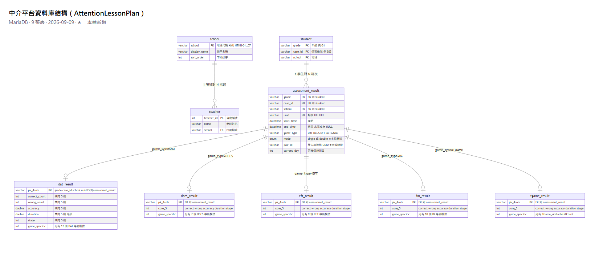
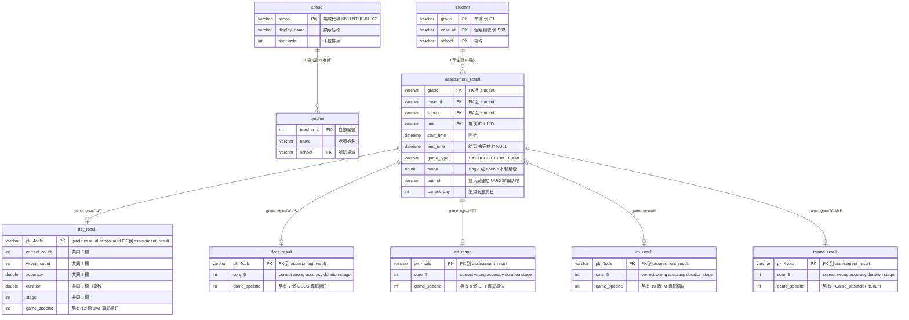

# 資料庫結構（中介平台 `AttentionLessonPlan`）

MariaDB。9 張表：3 張「參照 / 名冊」+ 1 張「場次索引」+ 5 張「各遊戲細部成績」。

- 精確 DDL：[`tests/schema.sql`](../tests/schema.sql)（正式庫與測試庫都照這份建）
- 本輪新增：`assessment_result` 加 `mode` / `pair_id`（單雙人版）；新增 `school` / `teacher`（選單登入）

---

## ER 圖

（下方是同一張圖的原始碼，在 GitHub 上會自動渲染；上方 PNG 供 GitHub 以外的地方看。）

> 每張 `*_result` 的主鍵都是 `(grade, case_id, school, uuid)` 四欄複合，同時是指向
> `assessment_result` 的外鍵。上圖為了好讀把這 4 欄縮成一列表示。

---

## 關係說明

| 關係 | 意義 |
|---|---|
| `school` → `teacher` | 一個場域有多位老師（目前每場域 2 位）。老師掛在不存在的場域 → 外鍵擋下 |
| `student` → `assessment_result` | 一位學生有多場遊玩紀錄。學生唯一鍵是 `(grade, case_id, school)` 三欄複合 —— **不同場域的 `G1_S03` 是不同的學生** |
| `assessment_result` → 五張 `*_result` | 一場 = 一列 `assessment_result`（索引 + 共同欄位）+ 一列對應遊戲的細部表。`game_type` 決定掛哪張。刪 `assessment_result` 會連帶刪細部列（`ON DELETE CASCADE`） |
| `school` ↔ `student.school` | **刻意不加外鍵**（正式庫可能有舊資料、Unity 寫入不該被參照資料擋下）。`school` 表當「合法場域字串的登記處」用 |

---

## 本輪的結構變更

### `assessment_result` 加兩欄

| 欄位 | 型別 | 說明 |
|---|---|---|
| `mode` | `enum('single','double')` NOT NULL DEFAULT `'single'` | 這場是單人版還是雙人版。既有資料自動變 `single`，不用回填 |
| `pair_id` | `varchar(36)` NULL | 雙人局的識別碼（Unity 產生）。同一局的兩位學生兩筆共用一個。`single` 時為 NULL。目前只存不查，日後做「搭檔對照」再加索引 |

五張遊戲結果表**完全不動**（廠商定調雙人版欄位與單人版一樣）。

### 新增 `school`、`teacher`

做「場域 → 老師 → 學生 → 進度」的選單式登入（無密碼，廠商定調下拉選人）。
兩張都是「人工維護、量少、變動極慢」的參照資料，由 `seed_directory.py` 冪等灌注。

- `school.school` = 與 `student.school` 完全相同的字串。目前定案為 `KMU`、`NTHU-01`…`NTHU-07`
- `teacher` 沒有密碼欄位（不驗證）；`UNIQUE(school, name)` 防同場域重名

---

## 給你（或廠商）在 DBeaver 自己產 ER 圖

DBeaver Community 內建：

1. 左邊樹展開到 `AttentionLessonPlan`
2. 右鍵點 **Tables**（或該 database）→ **View Diagram**（檢視圖表）
3. 它會自動畫出所有表和外鍵連線
4. 右鍵圖 → **Save Diagram as → PNG / SVG** 可匯出成圖片給廠商

（`AttentionLessonPlan` 目前 `student` / 5 張結果表是空的 —— 空表不影響 ER 圖，結構照樣畫得出來。）
